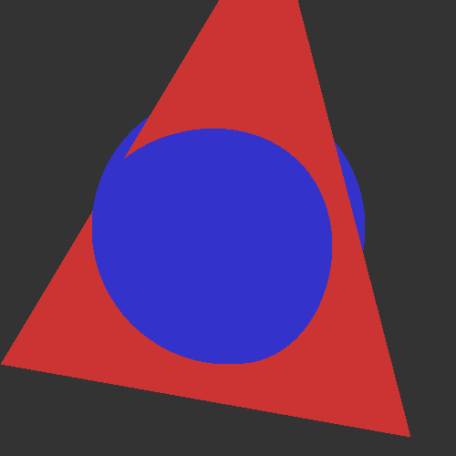

# Baldr

`TODO: Refine notes, and add in learning resources.`

## Chapter 01

RGB, Vectors, Orthonormal Basis

## Chapter 02 

Parametric lines

Parametric Surfaces

Sphere:
discriminant in the quadratic equation (sphere intersection).
if negative, no intersection. if positive, there are 2 solution (where the ray enters, and exists). If zero, it touches the edge of the sphere.

Triangle:
Barycentric coordinates
Cramer's rule (fastest way to solve 3x3 linear system)

## Chapter 03

End of Chapter 3, we have a simple simple colored shapes. 

### Sampling
 - Jittered
 - Multi-Jittered 
 - Poisson disk
 - Monte Carlo

// Important things:

 
